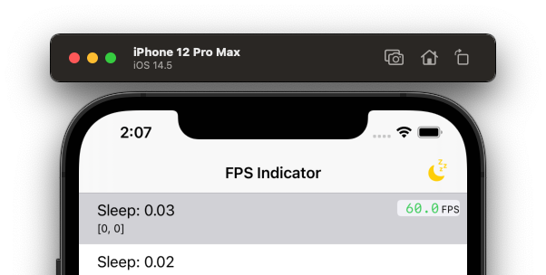

# FPSIndicator


[![Swift Version][swift-image]][swift-url]
[![License][license-image]][license-url]
[](http://cocoapods.org/pods/LFAlertController)



## Features
- [x] Display FPS (up to 120Hz)
- [x] Drag to move
- [x] Customize appearance
- [x] Optional [“geiger counter”](https://github.com/kconner/KMCGeigerCounter) functionality that reports dropped frames as an audible click 
- [x] Support Swift package manager 

## Requirements

- iOS 14.0+


## Note
Please check [Optimizing ProMotion Refresh Rates for iPhone 13 Pro and iPad Pro](https://developer.apple.com/documentation/quartzcore/optimizing_promotion_refresh_rates_for_iphone_13_pro_and_ipad_pro) to adapt high refresh rate.

## Usage example

```swift
import UIKit

#if DEBUG
import FPSIndicator
#endif

class SceneDelegate: UIResponder, UIWindowSceneDelegate {

    var window: UIWindow?

    #if DEBUG
    var fpsIndicator: FPSIndicator?
    #endif

    func scene(_ scene: UIScene, willConnectTo session: UISceneSession, options connectionOptions: UIScene.ConnectionOptions) {
        guard let windowScene = (scene as? UIWindowScene) else { return }
        window = UIWindow(windowScene: windowScene)

        window?.rootViewController = UINavigationController(rootViewController: ViewController())
        window?.makeKeyAndVisible()

        #if DEBUG
        fpsIndicator = FPSIndicator(windowScene: windowScene)
        FPSIndicator.geigerCounterEnabled = true            // optional
        FPSIndicator.geigerEnableWhenFrameDropBeyond = 20   // tick when frame drop more then 20FPS (a.k.a under 40FPS in 60FPS device)
        #endif
        
        // Note:
        // The FPSIndicator will create a overlay transparent window
        // which may break your status bar apperance by accident.
    }
}
```

## Acknowledgements

- [YYText](https://github.com/ibireme/YYText/blob/master/Demo/YYTextDemo/YYFPSLabel.m)
- [KMCGeigerCounter](https://github.com/kconner/KMCGeigerCounter)

## Meta

Cirno MainasuK – [@MainasuK](https://twitter.com/mainasuk) – cirno.mainasuk@gmail.com

Distributed under the MIT license. See [LICENSE](./LICENSE) for more information.

[swift-image]:https://img.shields.io/badge/swift-5.3-orange.svg
[swift-url]: https://swift.org/
[license-image]: https://img.shields.io/badge/License-MIT-blue.svg
[license-url]: LICENSE
